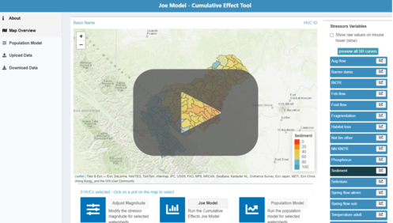

# JoeModelCE 

<!-- badges: start -->
<!-- badges: end -->

The Joe Model Cumulative Effects package (JoeModelCE) is a collection of tools and functions designed to support the implementation of the ‘Alberta Environmental Parks Cumulative Effects Assessment Joe Model’ [source](https://waves-vagues.dfo-mpo.gc.ca/Library/40871344.pdf) to other systems. The JoeModelCE r package is coupled with a flexible population modeling framework so that users may compare and contrast simple watershed level roll-ups with more rigorous population models. This package is accompanied by an interactive [web application](https://essa.shinyapps.io/JoeModelCEShiny). For more details see the [project website](https://essatech.github.io/JoeModelCE/index.html) for tutorial articles and case studies.

**[Shiny App Tutorial Video](https://youtu.be/Cp3UdWlkaKU)** [access the tool](https://essa.shinyapps.io/JoeModelCEShiny)

[](https://youtu.be/Cp3UdWlkaKU)


## Package Contributors:
This is a broad collaboration between Fisheries and Oceans Canada (DFO), B.C. Ministry of Environment and Climate Change Strategy (ECCS), Alberta Environment and Parks (AEP), and Simon Fraser University (SFU). 

Contributors include:

-   [Dr. Eva Enders](https://profils-profiles.science.gc.ca/en/profile/eva-enders): Project Lead; DFO Research Scientist
-   [Dr. Jordan Rosenfeld](http://www.aferu.ca/rosenfeld-lab): Project design and coordination; ECCS Aquatic Ecologist
-   [Dr. Andrew Paul](https://github.com/andrewpaul68): Collaborator; AEP Research Scientist
-   [Dr. Kyle Wilson](https://github.com/klwilson23): Population model development.
-   [Isuru Dharmasena](https://www.linkedin.com/in/isuru-dharmasena-90269895/?originalSubdomain=ca): Core Shiny app development
-   [Matthew Bayly](https://github.com/mattjbayly), Marc Porter, Alejandra Urcelay, and [Julian Heavyside](https://github.com/julianheavyside) from [ESSA Technologies Ltd](https://essa.com/): R package and Shiny app development support.
-   Lauren Jarvis
-   Pedro Gonzalez


## Features
- Run custom implementations of the Joe Model on non-standard data formats.
- Batch-run the integrated Joe Model/Population model across large datasets.
- Run sensitivity tests.
- Explore model extensions.


## Installation

The easiest way to install the `JoeModelCE` package is from within the [RStudio IDE](https://www.rstudio.com/products/rstudio/download/) using `remotes::install_github()`. At this time the package has not been published to CRAN so the default `install.packages()` will not work. Instead use remotes (or devtools) to install the packge directly from GitHub:
``` r
# You may need to install remotes
library(remotes)
remotes::install_github("essatech/JoeModelCE")
```

## Usage
There are several vignettes available that provide detailed guidance for `JoeModelCE` usage and common workflows. See articles availabe on the main [JoeModelCE project page](https://essatech.github.io/JoeModelCE/index.html):

- [Tutorial 1: Joe Model Overview](https://essatech.github.io/JoeModelCE/articles/joe-model.html)
- [Tutorial 2: Population Model Overview](https://essatech.github.io/JoeModelCE/articles/population-model.html)

## Code of Conduct

Please note that the `JoeModelCE` package is released with a [Contributor Code of Conduct](https://pkgs.rstudio.com/rmarkdown/CODE_OF_CONDUCT.html). By contributing to this project, you agree to abide by its terms.

