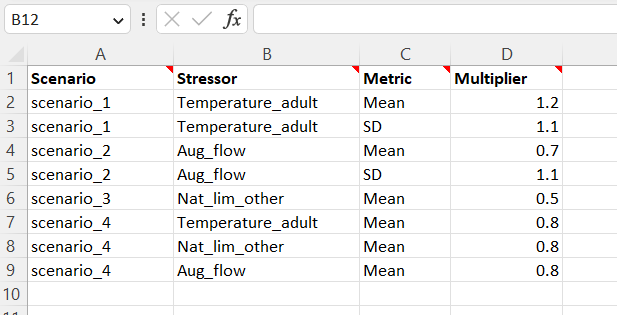

```{r, include = FALSE}
knitr::opts_chunk$set(
  collapse = TRUE,
  comment = "#>"
)
# browseVignettes()
library(kableExtra)
```

# Overview

It can be helpful to perform batch replicate runs with the Joe Model by changing the stressor magnitude values by a fixed percentage. For a hypothetical scenario that represents climate change we can either create a whole new stressor magnitude file that is derived from empirical data and contains values for the projected stressors into the future and rerun the model. Alternatively, we may simply just want a scenario where number of stressors are increased or decreased by a given fraction. The Joe model scenario batch run function allows us to do this.

The Joe model batch run function is very similar to the default Joe model function; however, it includes the addition of a special scenario file. The scenario file specifies scenario names along with series of stressors that each scenario will modify. The code loops through each scenario and then each stressor within each scenario and adjusts values according to a specified multiplier. For example, a multiplier of 1.2 would change the values of Temperature_adult from 18C to 21.6C. The image below shows a sample hypothetical scenarios file with four hypothetical scenarios.

```{r, tsamp, echo = FALSE}


```

# Setup and Installation

At this time the Joe Model R package is hosted on GitHub and can be installed using devtools. Hopefully in the near future the near future the package will be available on R-CRAN for standard installation and loading.

```{r install, message=FALSE, warning=FALSE}
# library(devtools)
# install_github("essatech/JoeModelCE")
library(JoeModelCE)
```

# Import Data

In the next step well import the data for the Joe Model. Recall the Joe Model needs a stressor magnitude Excel file and a stressor response Excel file. in this special case (for batch runs) we will also include a `scenarios` file which can be imported as a dataframe. The following file paths (below) are loading sample datasets from within the R-package. For your application, please update the file paths to other excel workbooks on your computer. Take special care to ensure the formatting of the data is correct. Also ensure that the spelling of the stressor labels is consistent across all three input files (e.g., temperature_adults).

```{r, format_demo77, echo = FALSE, message=FALSE, warning=FALSE}

# Import stressor-magnitude workbook
filename <- system.file("extdata", "stressor_magnitude_unc_ARTR.xlsx", package = "JoeModelCE")
stressor_magnitude <- StressorMagnitudeWorkbook(filename = filename, scenario_worksheet = "natural_unc")

# Import stressor-response workbook
filename <- system.file("extdata", "stressor_response_fixed_ARTR.xlsx", package = "JoeModelCE")
stressor_response <- StressorResponseWorkbook(filename = filename)

# Import the custom scenarios workbook
filename <- system.file("extdata", "scenario_batch_joe.xlsx", package = "JoeModelCE")
scenarios <- readxl::read_excel(filename)

```

# Run the Joe Model in Batch Mode

We will run the Joe Model in batch model across scenarios and have outputs into a single consolidated dataframe called `exp_dat`. In this tutorials `MC_sims` Monte Carlo replicates is only set to 3 to save time (please increase this for your application).

```{r, format_demo1, message=FALSE, warning=FALSE}

# ?JoeModel_Run_Batch -- see help

# Run the Joe Model with batch scenarios
exp_dat <- JoeModel_Run_Batch(scenarios = scenarios,
                              dose = stressor_magnitude,
                              sr_wb_dat = stressor_response,
                              MC_sims = 3)

head(exp_dat, 3)

```


# Plot Results By HUC (watershed)

In the next code block we show how results can be plotted across scenarios for a given watershed. the code to generate this plot could be put into a loop such that separate plots are generated for each watershed, printed to your file system and saved as PNG files.

```{r, format_demo88, echo = TRUE, message=FALSE, warning=FALSE, fig.width = 4, fig.height = 5, fig.cap="Results across scenario by HUC", fig.align = 'center'}

# Add mean and error bars (SD)
library(dplyr)
library(ggplot2)

#-----------------------------------------------------
# Plot result for single HUC - filter by name or ID
hub_sub <- exp_dat[exp_dat$HUC == 1701010204,]
plot_title <- paste0("Watershed Name - ", 1701010204)


hub_sb <- hub_sub %>% group_by(Scenario) %>%
summarise(mean = mean(CE, na.rm = TRUE),
		  sd = sd(CE, na.rm = TRUE))

hub_sb$lower <- hub_sb$mean - hub_sb$sd
hub_sb$upper <- hub_sb$mean + hub_sb$sd

ggplot(hub_sb, aes(x = mean, y = Scenario, xmin = lower, xmax = upper)) +
geom_rect(aes(xmin = 0, xmax = 0.2, ymin = -Inf, ymax = Inf),
		  fill = "pink", alpha = 0.02) +
geom_rect(aes(xmin = 0.2, xmax = 0.5, ymin = -Inf, ymax = Inf),
		  fill = "orange", alpha = 0.02) +
geom_rect(aes(xmin = 0.5, xmax = 0.75, ymin = -Inf, ymax = Inf),
		  fill = "yellow", alpha = 0.02) +
geom_rect(aes(xmin = 0.75, xmax = 1, ymin = -Inf, ymax = Inf),
		  fill = "green", alpha = 0.02) +
geom_point() +
geom_errorbarh(height=.2) +
ggtitle(plot_title) +
xlab("System Capacity (0 - 1)") + ylab("Recovery Scenario") +
theme_bw()


```


# Plot Results By Scenario

In the second example we show how all watersheds can be plotted for an individual scenario. The watersheds are filtered here for convenience but additional styling and customization is necessary for your application.

```{r, format_demo99, echo = TRUE, message=FALSE, warning=FALSE, fig.width = 4, fig.height = 12, fig.cap="Results across HUC by scenario", fig.align = 'center'}

#-----------------------------------------------------
# Plot result for single scenario
sen_sub <- exp_dat[exp_dat$Scenario == "scenario_1",]
plot_title <- paste0("Scenario 1 ...")

# Add mean and error bars (SD)
sen_sb <- sen_sub %>% group_by(HUC) %>%
summarise(mean = mean(CE, na.rm = TRUE),
		  sd = sd(CE, na.rm = TRUE))

sen_sb$lower <- sen_sb$mean - sen_sb$sd
sen_sb$upper <- sen_sb$mean + sen_sb$sd

sen_sb$HUC <- as.character(sen_sb$HUC)

ggplot(sen_sb, aes(x = mean, y = HUC, xmin = lower, xmax = upper)) +
geom_rect(aes(xmin = 0, xmax = 0.2, ymin = -Inf, ymax = Inf),
		  fill = "pink", alpha = 0.02) +
geom_rect(aes(xmin = 0.2, xmax = 0.5, ymin = -Inf, ymax = Inf),
		  fill = "orange", alpha = 0.02) +
geom_rect(aes(xmin = 0.5, xmax = 0.75, ymin = -Inf, ymax = Inf),
		  fill = "yellow", alpha = 0.02) +
geom_rect(aes(xmin = 0.75, xmax = 1, ymin = -Inf, ymax = Inf),
		  fill = "green", alpha = 0.02) +
geom_point() +
geom_errorbarh(height=.2) +
ggtitle(plot_title) +
xlab("System Capacity (0 - 1)") + ylab("Recovery Scenario") +
theme_bw()


```


